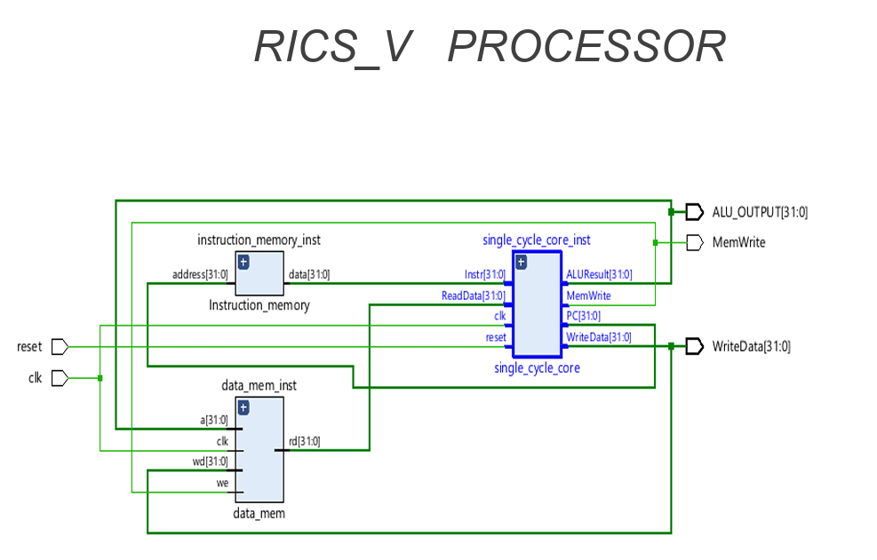
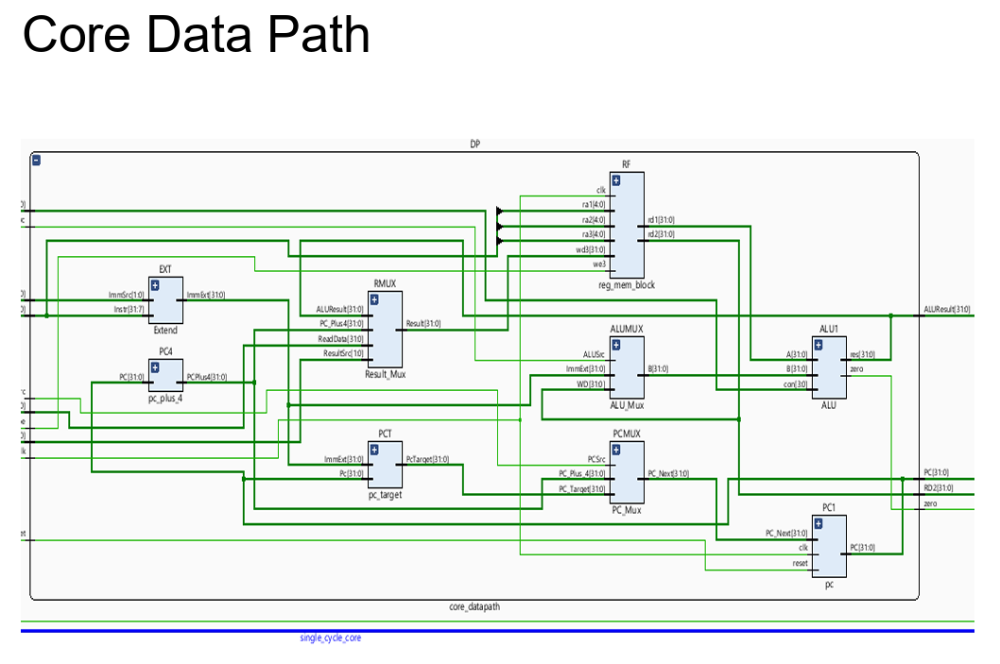
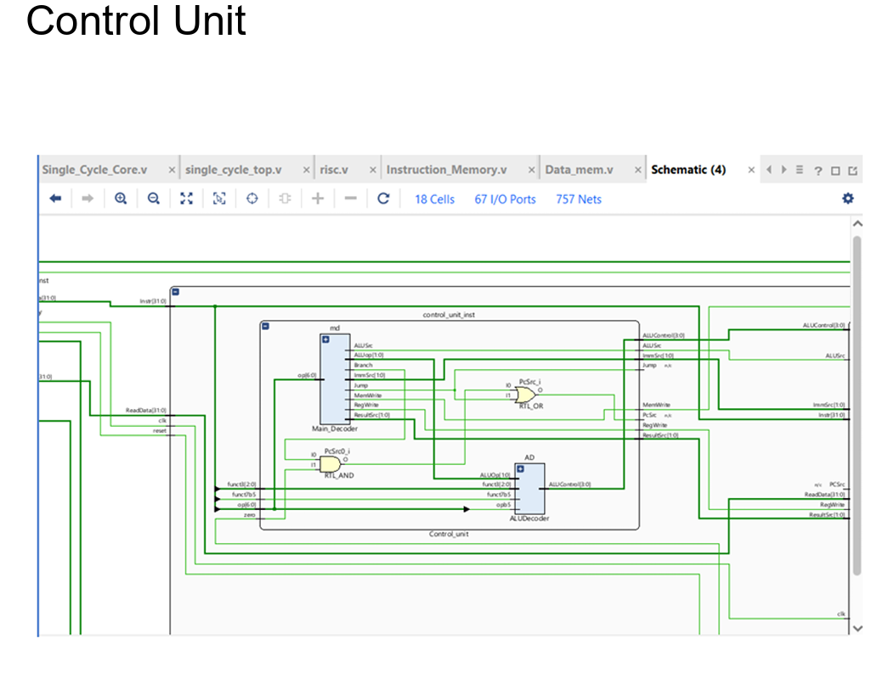
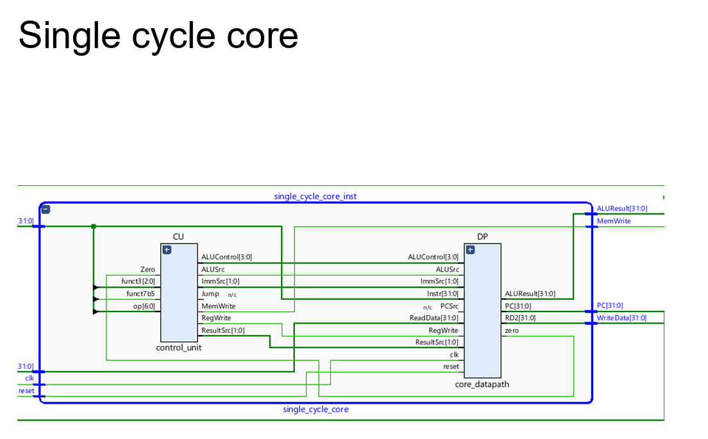
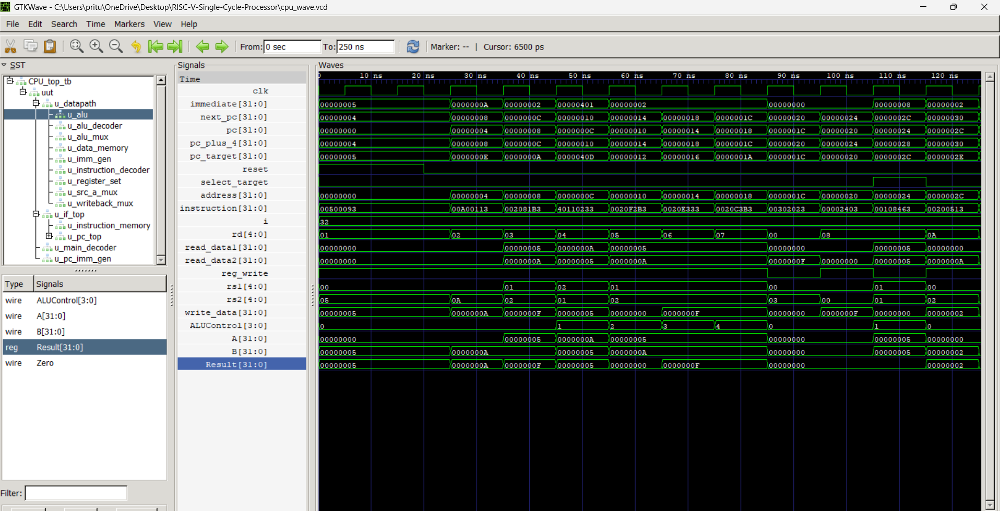
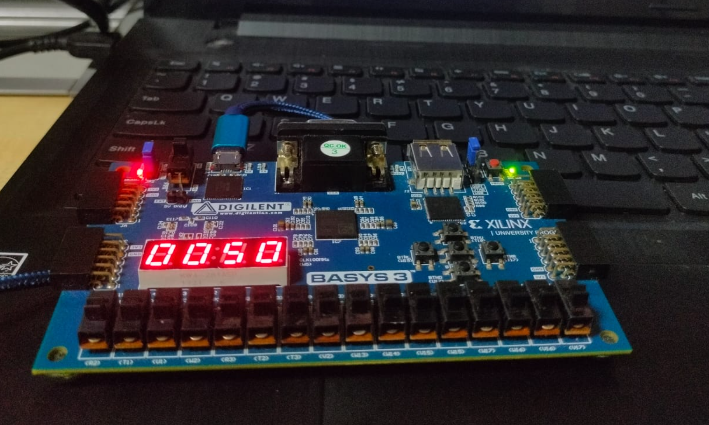

# RISC-V Single-Cycle Processor

### 32-bit RISC-V Processor | Verilog HDL | RTL Design | Functional Verification

A modular RTL implementation of a 32-bit RISC-V single-cycle processor developed in Verilog HDL.

This project focuses on understanding and implementing a processor from fundamental hardware building blocks and integrating them into a complete instruction-execution datapath.

The design separates the **datapath** and **control logic** into modular RTL blocks, making instruction flow, data movement, control-signal generation, and processor behavior observable at the RTL level.

---

## Project Overview

The processor follows the fundamental single-cycle instruction execution flow:

**Instruction Fetch → Instruction Decode → Execute → Memory Access → Write Back**

Each instruction is processed within a single clock cycle.

The processor is organized around the following major sections:

- Instruction Fetch Path
- Core Datapath
- Control Unit
- Instruction Memory
- Data Memory

The modular organization allows individual hardware blocks to be developed, integrated, simulated, and verified independently before complete processor-level verification.

---

## Processor Architecture

The top-level processor integrates the instruction-fetch logic, core datapath, control unit, instruction memory, and data memory.

### Top-Level Architecture



The top-level design provides the clock and reset interface and connects the processor core with the instruction and data memory interfaces.

Important processor-level signals include:

- Clock
- Reset
- Program Counter
- Instruction
- ALU Output
- Memory Write
- Write Data

---

## Core Data Path

The core datapath is responsible for transferring, selecting, and processing instruction and operand data.



The datapath contains the major hardware blocks required for instruction execution:

- Program Counter (PC)
- PC + 4 Logic
- PC Target Generation
- PC Multiplexer
- Register Set
- Immediate Generator
- Source-A Multiplexer
- ALU Multiplexer
- ALU
- Data Memory Interface
- Write-Back Multiplexer

### Datapath Operation

The current Program Counter provides the address used to access instruction memory.

The fetched instruction is decoded to determine:

- Source registers
- Destination register
- Immediate field
- Instruction type
- Required control signals

The Register Set provides the source operands required by the instruction.

The Immediate Generator produces the appropriate immediate value from the instruction.

Multiplexers select the required data paths according to the control signals.

The ALU performs the selected arithmetic or logical operation. For memory-access instructions, the ALU result can also be used as the data-memory address.

The Write-Back Multiplexer selects the appropriate result before it is written back to the destination register.

---

## Instruction Fetch Path

The instruction-fetch section is responsible for generating and updating the Program Counter.

The main components are:

- Program Counter
- PC + 4 Logic
- PC Target Generation
- PC Selection Multiplexer
- Instruction Memory Interface

For normal sequential execution:

**Next PC = PC + 4**

For control-flow instructions, the PC target logic provides an alternative target address.

The PC selection logic determines which address is supplied to the Program Counter for the next instruction.

---

## Control Unit

The control unit decodes the current instruction and generates the control signals required to configure the datapath.



The control path is implemented using dedicated RTL blocks including:

- Instruction Decoder
- Main Decoder
- ALU Decoder

The control logic determines processor behavior through signals such as:

- Register Write Enable
- Memory Write Enable
- ALU Source Selection
- ALU Operation
- Result Source Selection
- Branch Control
- Jump Control
- Immediate Source Selection

Separating the control logic from the datapath keeps the processor architecture modular and makes individual control decisions easier to analyze during RTL simulation.

---

## RTL Design Philosophy

The processor was developed using a **bottom-up RTL design methodology**.

Instead of implementing the processor as one large hardware block, the design is decomposed into smaller functional RTL modules.

Each module is responsible for a specific hardware function.

### Modular Hardware Design

The processor is constructed from independent functional blocks such as:

- Program Counter
- Register Set
- ALU
- Immediate Generator
- Instruction Decoder
- Main Decoder
- ALU Decoder
- Instruction Memory
- Data Memory
- Multiplexers

This modular structure improves:

- Readability
- Debugging
- Reusability
- Functional Verification
- Hierarchical Integration

### Datapath and Control Separation

The datapath is responsible for data movement and computation.

The control unit generates the signals that configure the datapath for the current instruction.

This separation makes the instruction-execution process easier to analyze at the RTL level.

### Hierarchical Integration

Individual RTL modules are connected hierarchically to construct the complete processor.

This approach allows internal processor signals to be observed during simulation and makes functional issues easier to isolate.

---

## Instruction Execution Flow

The processor executes instructions through the following logical sequence.

### 1. Instruction Fetch

The Program Counter provides the instruction address.

The instruction memory returns the corresponding 32-bit instruction.

The sequential address is generated using:

**PC + 4**

---

### 2. Instruction Decode

The instruction is decoded to determine:

- Source register addresses
- Destination register address
- Immediate field
- Instruction type
- Required control signals

---

### 3. Operand Selection

The Register Set provides the required source operands.

The Immediate Generator produces the instruction-specific immediate value.

Multiplexers select the appropriate operands for the ALU based on the generated control signals.

---

### 4. Execute

The ALU performs the selected arithmetic or logical operation.

The ALU operation is determined by the control signals generated by the control unit.

The ALU also produces a Zero indication used by the control-flow logic where required.

---

### 5. Memory Access

For memory-related instructions, the ALU output can be used as the memory address.

The data memory performs the required read or write operation according to the memory control signals.

---

### 6. Write Back

The Write-Back Multiplexer selects the value that should be written to the destination register.

When register write is enabled, the selected result is written into the Register Set.

---

## Processor Core

The integrated processor core combines the datapath and control logic into a complete single-cycle execution unit.



The hierarchical implementation allows the major processor components to be individually inspected while also providing a complete processor-level structure.

---

## Verification

The processor was functionally verified using a Verilog testbench.

Simulation was performed using **Icarus Verilog**, and the generated waveform was analyzed using **GTKWave**.

The verification process focuses on observing the interaction between datapath signals and control signals across multiple clock cycles.

The following internal signals were observed during simulation:

- Clock
- Reset
- Program Counter
- Next PC
- PC + 4
- PC Target
- Instruction
- Immediate
- Register Source Addresses
- Register Read Data
- Register Write Enable
- Write-Back Data
- ALU Control
- ALU Operands
- ALU Result
- Zero Flag
- Memory Address
- Memory Write Control
- Memory Read Data

---

## GTKWave Simulation

The RTL simulation waveform was inspected using GTKWave to verify processor behavior across multiple clock cycles.



The waveform provides signal-level visibility into the relationship between:

- Clock cycles
- Program Counter updates
- Instruction addresses
- Instruction values
- Register operations
- Immediate values
- ALU operations
- Memory operations
- Control signals
- Write-back behavior

Signal-level observation helps verify the interaction between individual RTL modules and the complete processor datapath.

---

## Hardware Demonstration

The processor development workflow also includes a hardware-oriented FPGA environment using the **Digilent Basys 3 FPGA development board**.



The hardware setup provides a practical FPGA development environment alongside the RTL design and simulation workflow.

The overall development flow therefore covers:

**RTL Design → Simulation → GTKWave Waveform Verification → FPGA Hardware Environment**

---

## Design Verification Approach

Verification was performed progressively during development.

The general methodology was:

1. Implement individual RTL modules.
2. Verify module-level behavior.
3. Integrate the modules into the core datapath.
4. Integrate the control unit with the datapath.
5. Connect instruction and data memory.
6. Run the complete processor testbench.
7. Inspect internal signals using GTKWave.
8. Verify Program Counter progression.
9. Verify ALU operations and results.
10. Verify register activity and write-back behavior.
11. Verify memory-related control and data signals.

This bottom-up verification approach helps isolate functional issues before complete processor integration.

---

## Project Structure

```text
RISC-V-Single-Cycle-Processor/
│
├── docs/
│   └── images/
│       ├── single_cycle_top.png
│       ├── core_datapath.png
│       ├── control_unit.png
│       ├── single_cycle_core.png
│       ├── waveform.png
│       └── hardware.png
│
├── rtl/
│   └── Verilog RTL source files
│
├── tb/
│   └── CPU testbench
│
├── README.md
├── .gitignore
│
└── Simulation files
```

---

## 👋 Author

**Ritu Priya** — [RISC-V Single-Cycle Processor](https://github.com/pritu8440-lgtm/RISC-V-Single-Cycle-Processor)

Designed and developed by **Ritu Priya** as a hands-on RTL implementation of a 32-bit RISC-V single-cycle processor using Verilog HDL, with emphasis on modular hardware design, datapath and control integration, simulation, and signal-level verification.

---